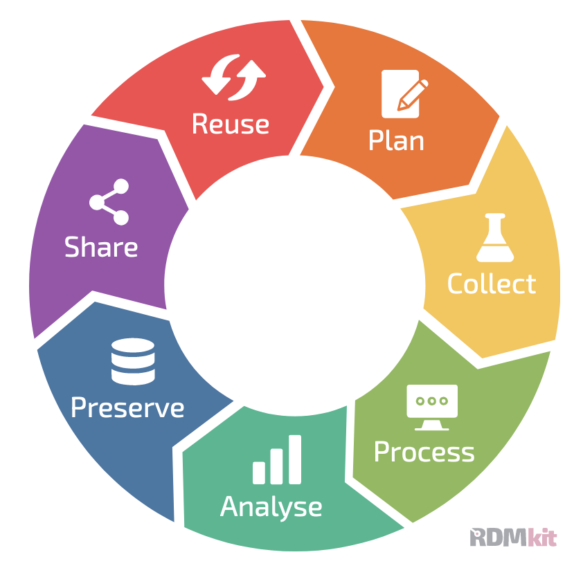
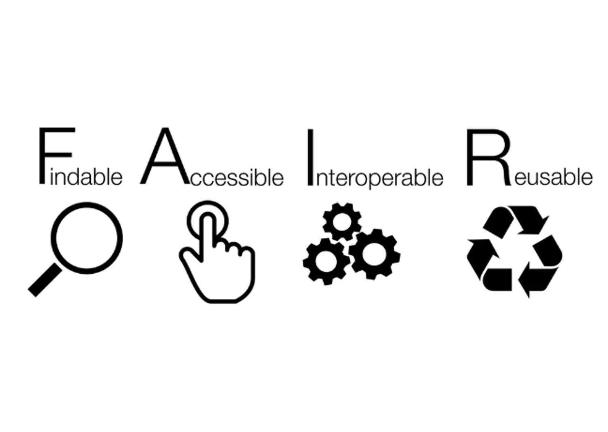

Day 1 - only beginning to dream about being a bioinformatician

Data Management and reproducible research


FAIR principles

FAIR principles rely on good data management practices in all phases of research:

Research documentation
Data organisation
Information security
Ethics and legislation



Best practices for file organisation

- There is a folder for the raw data, which does not get altered.
- Code is kept separate from data.
- Use a version control system (at least for code) – e.g. git.
- There should be a README in every directory, describing the purpose of the directory and its contents.
- Use file naming schemes that makes it easy to find files and understand what they are (for humans and machines) and document them.
- Use non-proprietary formats – .csv rather than .xlsx

Literate programming
- Document your methods and workflows.
- Document where and when you downloaded data.
- Document the versions of the software that you ran.

Future learnings in the course:
- Version control
- environment managers
- containers in bioinformatics
- workflow manager

Github:
Useful commands:

```{r}
#| eval: false
# CLONE A REPO
git clone https://github.com/username/repo.git

# BASIC WORKFLOW
git status                    # See what changed
git add .                     # Stage all changes
git commit -m "message"       # Commit with message
git push                      # Push to GitHub
git pull                      # Pull latest changes

# BRANCHES
git branch                    # List branches
git branch new-branch         # Create new branch
git checkout new-branch       # Switch to branch
git checkout -b new-branch    # Create and switch
git push origin new-branch    # Push branch to GitHub

# UNDO CHANGES
git restore filename          # Undo changes to file
git reset HEAD~1              # Undo last commit (keep changes)
git revert HEAD               # Undo last commit (create new commit)

# VIEW HISTORY
git log                       # See commits
git log --oneline             # Shorter view
git diff                      # See what changed

# MERGE BRANCHES
git checkout main             # Switch to main
git merge new-branch          # Merge branch into main

# STASH (TEMPORARY SAVE)
git stash                     # Save changes temporarily
git stash pop                 # Restore changes
```
