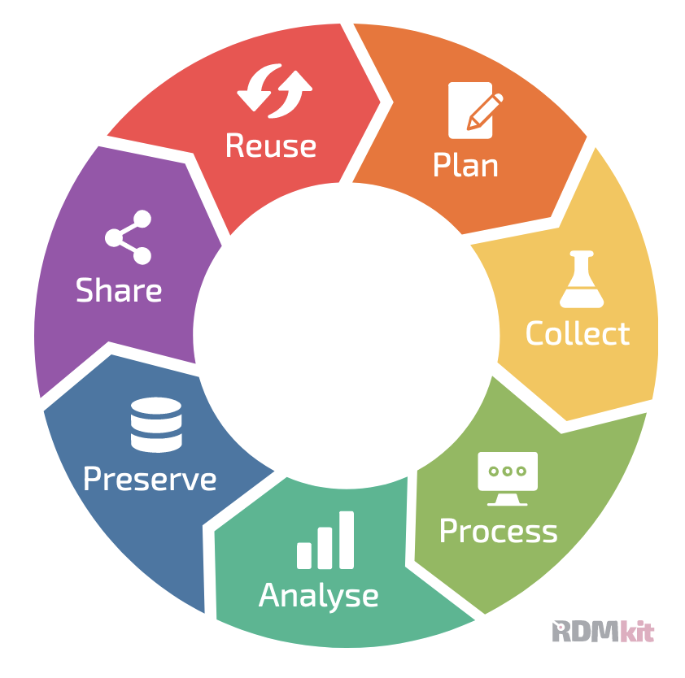
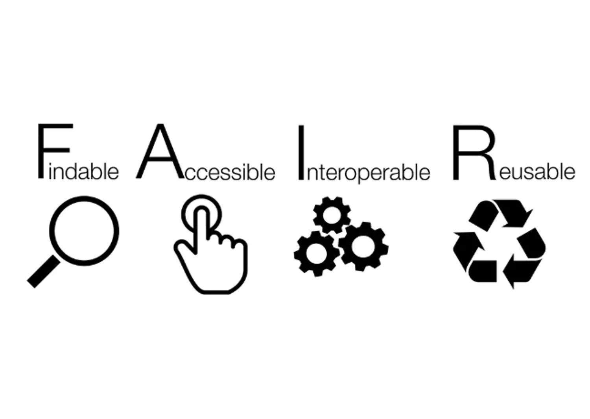

## Day 1: only beginning to dream about being a bioinformatician

Today was all about **data management and reproducible research**: the habits that make an analysis something you (and others) can trust and repeat.

{fig-alt="Diagram of the research data life cycle"}

## FAIR principles

Data should be **F**indable, **A**ccessible, **I**nteroperable and **R**eusable. The FAIR principles rely on good data management in every phase of research:

- Research documentation
- Data organisation
- Information security
- Ethics and legislation

{fig-alt="Infographic of the FAIR data principles"}

## Best practices for file organisation

- Keep a folder for the **raw data**, and never alter it.
- Keep code separate from data.
- Use a version control system (at least for code), e.g. git.
- Put a README in every directory describing its purpose and contents.
- Use file naming schemes that make files easy to find and understand, for humans and machines, and document them.
- Use non-proprietary formats: `.csv` rather than `.xlsx`.

## Literate programming

- Document your methods and workflows.
- Document where and when you downloaded data.
- Document the versions of the software you ran.


## Git cheat sheet

Here are some git commands worth keeping handy.

### Getting started

```bash
git clone https://github.com/username/repo.git   # clone a repo
```

### Basic workflow

```bash
git status                    # see what changed
git add .                     # stage all changes
git commit -m "message"       # commit with a message
git push                      # push to GitHub
git pull                      # pull the latest changes
```

### Branches

```bash
git branch                    # list branches
git branch new-branch         # create a new branch
git checkout new-branch       # switch to a branch
git checkout -b new-branch    # create and switch in one go
git push origin new-branch    # push the branch to GitHub
```

### Undoing changes

```bash
git restore filename          # undo changes to a file
git reset HEAD~1              # undo last commit (keep changes)
git revert HEAD               # undo last commit (by creating a new commit)
```

### Viewing history

```bash
git log                       # see commits
git log --oneline             # shorter view
git diff                      # see what changed
```

### Merging branches

```bash
git checkout main             # switch to main
git merge new-branch          # merge the branch into main
```

### Stashing (temporary save)

```bash
git stash                     # save changes temporarily
git stash pop                 # restore them
```