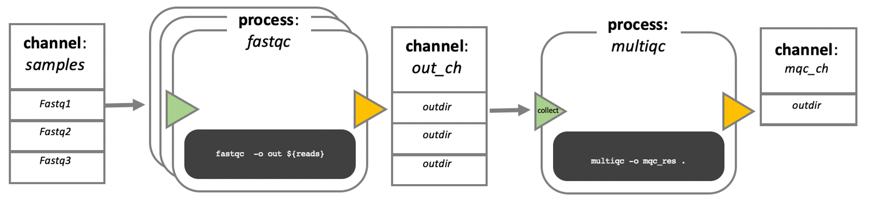

Day 3 - Introduction to Nextflow
When developing your code in bioinformatics, you will likely use different tool for different parts of your analyses. Traditionally, you would have about one script per tool, all of which you deploy by hand, one after the other. Together, this is called a workflowor pipeline.

Manual deployment of pipelines can be tedious, especially if you have analyses with many steps, or many samples of different sizes that might need a varying amount of computational power. Luckily for you, other bioinformaticians and software developers have developed something to make your life much easier:

Workflow managers
Workflow managers provide a framework for the creation, execution, and monitoring of pipeline. <…> They simplify pipeline development, optimize resource usage, handle software installation and versions, and run on different compute platforms, enabling workflow portability and sharing. Wratten et al. (2021) Nature Methods

With workflow managers you can develop an automated pipeline from your scripts that can then be run on a variety of systems. Once it is developed, execute a single command to start the pipeline. The manager then coordinates the deployment of the scripts in the appropriate sequence, monitors the jobs, handles the file transfers between scripts, gathers the output, and handles re-execution of failed jobs for you. Workflow managed pipelines can run containers, which eliminates software installation and version conflicts.

That means that by design the pipelines are:

portable
more time efficient (no more downtime between pipeline steps)
more resource efficient (mostly, but this might vary depending how skilled a developer you yourself are)
easier to install (especially when combined with containers, or environment managers)
more reproducible
There are in principle two different flavors of workflow managers: snakemake, and nextflow. In this course we will be introducing you to nexflow.



In nextflow, your scripts are turned into processes, connected by channels that contain the data - input, output etc. The order of the processes, and their interaction with each other, is specfied in the workflow scope.

The executable part of the processes, the so called script, can be written in any language, so in theory you could always choose the language that is best suited for the job (in practice you might be limited to the languages you know). However, the modularity of the processes allows for easy re-use of existing scripts and processes.

When moving the pipeline from one system to another, the script stays the same and does not change, the same containers are used. The only thing that changes are the parameters that pertain to the environment and available resources. In other words, with nextflow, the functional logic, the processes, are separated from the executive (how the workflow runs). This makes the nextflow pipelines highly interoperable and portable. They can be run on various platforms, such as HPC clusters, local computers, cloud systems etc..

The pipelines can be integrated with version control tools, such as git or bitbucket, and containers technologies, such as apptainer or docker. This makes the pipeline very reproducible.

The nextflow pipelines are extremely scalable, can be developed on a few samples and easily be run on hundreds or thousands of samples. When possible, processes are run in parallel automatically.

Nexflow performs automatic checks on the processes and their in- and output. It can automatically resume execution at a point of failure without having to re-compute successfully completed parts.

Nextflow is open source.

Here is a more visual summary of some of the points above:
Write code in any language
orchestrate tasks with dataflow programming
define software dependencies via containers
built-in version control with Git
Task orchestration and execution

How to work with Nextflow?
Any process can define one or more channels as an input and output. The interaction between these processes, and ultimately the workflow execution flow itself, is implicitly defined by these input and output declarations.

Process block looks a little bit like this:
```{bash}
#| eval: false
process PROCESS_NAME{
    // directives
    container
    
    input:
      data z
      data y
      data x

    script:
      task1
      task2
      task3

    output:
      output x
      output y
      output z
}
```

We started with:

```{bash}
#| eval: false
pixi init -c conda-forge -c bioconda
```

Something like this is a code in a .txt file
```{bash}
#| eval: false
#!/usr/bin/env nextflow

params.greeting = 'Hello world!'

process SPLITLETTERS {
    input:
    val x

    output:
    path 'chunk_*'

    script:
    """
    printf '$x' | split -b 6 - chunk_
    """
}

process CONVERTTOUPPER {
    input:
    path y

    output:
    stdout

    script:
    """
    cat $y | tr '[a-z]' '[A-Z]'
    """
}

workflow {
    greeting_ch = Channel.of(params.greeting)
    letters_ch = SPLITLETTERS(greeting_ch)
    results_ch = CONVERTTOUPPER(letters_ch.flatten())
    results_ch.view{ it }
}
```

If you run:

```{bash}
#| eval: false
pixi run nextflow run hello.nf
```

Output looks like
 N E X T F L O W   ~  version 25.04.7

Launching `hello.nf` [jolly_faraday] DSL2 - revision: f5e335f983

executor >  local (3)
[96/fd5f07] SPLITLETTERS (1)   [100%] 1 of 1 ✔
[7e/dad424] CONVERTTOUPPER (2) [100%] 2 of 2 ✔
HELLO 
WORLD!

The order might be different, both processes are executed next to each other.

If you want to change something, but not re-run the whole thing, you can use:

```{bash}
#| eval: false
pixi run nextflow run hello.nf -resume
```

Workflow parameters can be altered
As we have seen workflow parameters are simply declared by prepending the prefix params to a variable name, separated by a dot character (e.g. params.greeting). Their value can alternatively be specified on the command line by prefixing the parameter name with a double dash character, i.e. --paramName.

Nextflow log can get crowded - use this command to remove log files. 
```{bash}
#| eval: false
pixi run nextflow log
pixi run nextflow clean -f
pixi run nextflow clean -before <RUN NAME> -f
```

Nextflow RNAseq pipeline

Salmon — quantifies transcripts from RNA-seq data.
FastQC — performs quality control on high-throughput sequencing data.
MultiQC — searches a directory for analysis logs and compiles them into a single HTML report.

Step by step — and why each tool is used when:

Index the transcriptome reference — salmon index. Salmon cannot quantify reads against a plain FASTA; it first needs to turn the reference into a fast, searchable index. We do this once at the start, and every sample reuses the same index.

Quantify expression — salmon quant. For each sample, Salmon maps the read pair against the index and estimates how much of each transcript is present. Here Salmon turns raw reads into numbers to analyse.

Check read quality — FastQC. In parallel, FastQC inspects the raw reads of each sample (base quality, adapter content, and so on). We run it alongside quantification, not after, because quality control is independent of the counting.

Summarise everything — MultiQC. Finally, MultiQC gathers the logs from all the samples (Salmon and FastQC) into one HTML report, so you read a single summary instead of opening dozens of files. It waits for the all earlier steps to finish before it runs.


First step: Set the executor
You can specify your computer power in a file called nextflow.config. 

```{bash}
#| eval: false
process{
    executor = "slurm"
    time = '2.h'  // Set default time limit for all processes
    
    // Other settings
    cpus = 4
}

resume = true
singularity.enabled = true

executor {
    account = 'your_project_account'
}
```

This sets the executor for every process to slurm.

We set resume to true, so it is automatically used for all our runs (which means we do not have to specify this in our nextflow run command anymore).

We enable singularity and set some singularity run options.

Lastly, we specify the account name for the slurm execution, replace the placeholder with the actual compute allocation ID.

This nextflow.config file is implicitly called when we execute nextflow from the folder it is in. We do not have to explicitely name it in the nextflow run command.

Define the workflow parameters
Parameters are inputs and options that can be changed when the workflow is run.

The script script1.nf defines the workflow input parameters:

#!/usr/bin/env nextflow

params.reads = "$projectDir/data/ggal/gut_{1,2}.fq"
params.transcriptome_file = "$projectDir/data/ggal/transcriptome.fa"
params.multiqc = "$projectDir/multiqc"

workflow {
    println "reads: $params.reads"
}

Run it by using the following command:

pixi run nextflow run script1.nf

Note
Note that we do not need to specify that we want to use the nextflow.config file. Since it is in the same directory it will be used automatically.

ImportantTo do for you
Modify script1.nf by adding a fourth parameter named outdir and set it to a default path that will be used as the workflow output directory.

Create a transcriptome index file
Nextflow allows the execution of any command or script by using a process definition.

A process is defined by providing three main declarations: the process input, output, and the command script.

To add a transcriptome INDEX processing step, add the following code blocks to your script1.nf. Alternatively, these code blocks have already been added to script2.nf.

process INDEX {
    input:
    path transcriptome

    output:
    path 'salmon_index'

    script:
    """
    salmon index --threads $task.cpus -t $transcriptome -i salmon_index
    """
}

Additionally, replace the existing workflow scope with an input channel definition and the index process:

workflow {
    index_ch = INDEX(file(params.transcriptome_file, checkIfExists: true))
}

Here, the params.transcriptome_file parameter is used as the input for the INDEX process. The INDEX process (using the salmon tool) creates salmon_index, an indexed transcriptome that is passed as an output to the index_ch channel.

Run with:

pixi run nextflow run script1.nf 

Caution
Why doesn’t this work? What have we forgotten?

EITHER add Salmon to your environment
pixi add salmon

OR add Salmon in a container to the process
Adding a container to the process and running the tool via the container is more reproducible than adding it to your environment. Use the container directive and add the URL to the container to the process scope, above the input block:

container 'oras://community.wave.seqera.io/library/salmon:2.7.0--cb05356ce9eb88b7'

Note
You can also specify a process specific output directory in the process block:

publishDir "$params.outdir/salmon"

This command line would typically be located just below the container directive.

By default publishDir links the published files back into the work/ directory rather than copying them. This is fast and saves space, but it means the files disappear if you clean work/. Add mode: 'copy' when you want an independent copy that survives a cleanup, for example a result you intend to keep or share.

Define run time environment
Remember how Nextflow is big on execution abstraction? This is where we will put this concept into practice. In the nextflow.config add the following just before the closing squiggly bracket from the process definitions:

    withName:'INDEX'{
        time = 15.m
        cpus = 2
    }

With this we specify the alloted time and cpus for this specific process.

To specify memory add mem = xx.GB - check with your cluster to see how much memory is available and how to specify it. In our case we don’t need to because the memory implicit in the 2 cpus is enough for our purposes.

pixi run nextflow run script1.nf 

Interlude: Visualize tuples
Salmon needs both reads of a pair together to quantify a sample. Our data folder holds six files — three samples, two files each:

gut_1.fq    gut_2.fq
liver_1.fq  liver_2.fq
lung_1.fq   lung_2.fq
If we simply collected every .fq into one channel, Nextflow would see six loose files with nothing saying that gut_1 and gut_2 belong together. We need them grouped by sample.

That is what the fromFilePairs channel factory does, and we can have a look at it in script3.nf. The {1,2} in the pattern marks the part that differs between the two files of a pair; Nextflow groups the files that share everything else:

read_pairs_ch = channel.fromFilePairs(params.reads)

To see what it produces, view the channel from inside the workflow:

workflow {
    read_pairs_ch = channel.fromFilePairs(params.reads)
    read_pairs_ch.view()
}

Run it:

pixi run nextflow run script3.nf

It prints one item per sample:

[gut, [/.../data/ggal/gut_1.fq, /.../data/ggal/gut_2.fq]]

Read that line piece by piece — each item is a tuple with two parts:

gut — the sample ID, taken from the shared prefix of the file names, and
[gut_1.fq, gut_2.fq] — a list of the two files that belong to that sample.
Tip
Think of it like matching socks: fromFilePairs puts _1 and _2 together by their shared name, and the {1,2} glob tells Nextflow which part is allowed to differ.

Note
params.reads points at gut only, so you see one pair. Point it at all three samples to watch them grouped side by side:

pixi run nextflow run script3.nf --reads 'data/ggal/*_{1,2}.fq'

Because each item carries the ID and both files together, Salmon can process each sample in a single task — and Nextflow runs all three in parallel. That is the behaviour you will use in the next step.

Expression quantification
Look at the file “script4.nf”. This script adds a gene expression QUANTIFICATION process and a call to it within the workflow scope. Quantification requires the index transcriptome and RNA-Seq read pair fastq files.

In the workflow scope, note how the index_ch channel is assigned as output in the INDEX process.

Next, note that the first input channel for the QUANTIFICATION process is the previously declared index_ch, which contains the path to the salmon_index.

Also, note that the second input channel for the QUANTIFICATION process, is the read_pair_ch we just created. This being a tuple** composed of two elements (a value: “sample_id” and a list of paths to the fastq reads: “reads”) in order to match the structure of the items emitted by the fromFilePairs channel factory.

**tuple: a data structure consisting of multiple parts.

pixi run nextflow run script4.nf

Execute the same script again with more read files, as shown below:

pixi run nextflow run script4.nf --reads 'data/ggal/*_{1,2}.fq'

You will notice that the QUANTIFICATION process is executed multiple times.

Nextflow parallelizes the execution of your workflow simply by providing multiple sets of input data to your script.

ImportantTo do for you
Add the process specific runtime environment definition for QUANTIFICATION to nextflow.config.

Quality control
Now we want to add another process, using our beloved FastQC to check the samples. The input is the same as the read pairs used in the QUANTIFICATION step.

ImportantTo do for you
Sit together with your neighbour and first think 5 minutes what you need to do to implement this new process.

We will then discuss in class.

MultiQC
This last step collects the outputs from the QUANTIFICATION and FASTQC processes to create a final report using MultiQC.

Again, what do you need to consider when adding this process to the pipeline?

Tip
We only want one task of MultiQC to be executed to produce one report. For this, it needs to wait for the report generating processes to stop. We can use the mix channel operator to combine the two channels followed by the collect operator, to return the complete channel contents as a single element.

So the new line in the workflow scope looks like this:

MULTIQC(quant_ch.mix(fastqc_ch).collect())
