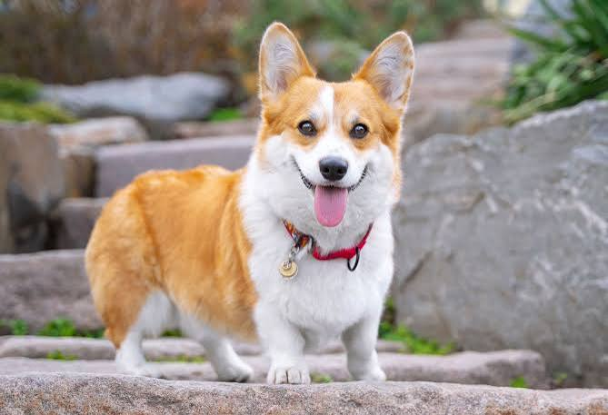
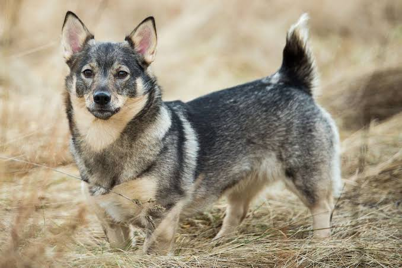

**Is a Swedish Valhund a Corgi? The Truth Behind the Confusion**

If you've seen a Swedish Valhund, you might have done a double-take. "Is that a corgi?" you might ask. The answer is both yes and no—and the story is more interesting than you think.

**What They Have in Common**

The Swedish Valhund and the Welsh Corgi do share striking similarities. Both are small herding dogs with short legs, long bodies, and sturdy builds. They were both bred to herd livestock (cattle for the Valhund, sheep for the Corgi) and have that characteristic low-to-the-ground frame that helped them nip at heels without getting kicked. Both are intelligent, alert, and full of personality. If you squint, you can definitely see the family resemblance.

**But They Are NOT the Same Breed**

Here's where they diverge:

**Origin:** The Swedish Valhund comes from Sweden (hence the name), where it's been herding cattle for over a thousand years. The Welsh Corgi originates from Wales and comes in two varieties: Pembroke and Cardigan.

**Appearance:** While both are short-legged, the Valhund is more compact and muscular. The Corgi tends to have a more fox-like face, while the Valhund has a more wolf-like expression. The Valhund's coat is typically gray or red with white markings, whereas Corgis come in red, sable, fawn, or black and tan.

**Tail:** This is a key difference! Swedish Valhunds have a naturally short, fox-like tail. Welsh Corgis (especially Pembrokes) often have their tails docked, though naturally they're longer and fuller.

**Size:** Valhunds are slightly smaller and lighter than Corgis, making them even more agile herders.

**Temperament:** While both are smart and spirited, the Valhund tends to be slightly more independent and has a stronger herding instinct. Corgis are often more affectionate and better known as companion dogs, especially after their association with British royalty.

**The Historical Mystery**

Interestingly, some dog historians believe the breeds may share ancient Viking ancestry. Swedish traders and raiders may have brought their dogs to Wales, or vice versa. However, they developed independently over centuries, becoming distinct breeds adapted to their respective countries' landscapes and livestock needs.

**The Bottom Line**

A Swedish Valhund is **not** a Corgi, but they're distant cousins in the herding dog family. Think of it like asking if a husky is a malamute—similar in some ways, but distinctly different breeds with their own history and characteristics.

If you're considering one as a pet, remember: while they look adorable and compact, both breeds need regular exercise, mental stimulation, and can be stubborn herders at heart. They'll try to herd your kids, your cats, and probably your guests' ankles if given the chance!

:::: {.columns}
::: {.column width="50%"}
{.img-circle width="300px"}
:::

::: {.column width="50%"}
{.img-circle width="300px"}
:::
::::
