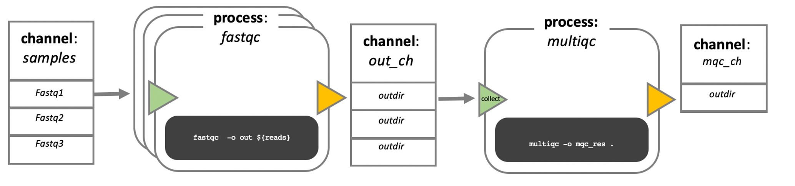

## Day 3: Nextflow! Finally, no more running one script after another by hand.

Why a workflow manager? Oh Why?

In bioinformatics you usually end up with one script per tool, and you run them one by one. That whole chain is a **workflow** (or pipeline). It gets old fast, especially with lots of samples that all need different amounts of compute.

A workflow manager turns your scripts into one automated pipeline. One command and it:

- runs everything in the right order
- keeps an eye on the jobs
- moves files between steps
- re-runs whatever failed

Bonus: pipelines are portable, reproducible, easier to install (especially with containers) and don't waste time between steps.

There are two big ones, **Snakemake** and **Nextflow**. We're doing Nextflow.

{fig-alt="Overview diagram of how Nextflow works"}

## Nextflow in a nutshell

- Scripts become **processes**, connected by **channels** (the data flowing in and out).
- The **workflow** block says what runs in which order.
- A process can run any language, so you can reuse old scripts.
- Same pipeline on a laptop, an HPC cluster or the cloud. Only the config changes.
- Works with git and containers (Apptainer, Docker).
- Develop on a few samples, then scale to hundreds.
- If something breaks, it can **resume** from the failed step instead of starting over.

A process looks roughly like this (pseudo-code, don't run it):

```groovy
process PROCESS_NAME {
    container
    input:
      data x
    script:
      task1
      task2
    output:
      output x
}
```

## First workflow

Start from a pixi environment (see [Day 2](day2.qmd)):

```{.bash}
#| eval: false
pixi init -c conda-forge -c bioconda
```

Then put this in `hello.nf`:

```groovy
#!/usr/bin/env nextflow

params.greeting = 'Hello world!'

process SPLITLETTERS {
    input:
    val x

    output:
    path 'chunk_*'

    script:
    """
    printf '$x' | split -b 6 - chunk_
    """
}

process CONVERTTOUPPER {
    input:
    path y

    output:
    stdout

    script:
    """
    cat $y | tr '[a-z]' '[A-Z]'
    """
}

workflow {
    greeting_ch = Channel.of(params.greeting)
    letters_ch = SPLITLETTERS(greeting_ch)
    results_ch = CONVERTTOUPPER(letters_ch.flatten())
    results_ch.view{ it }
}
```

```{.bash}
#| eval: false
pixi run nextflow run hello.nf
```

Output (the order can flip, because the two `CONVERTTOUPPER` tasks run at the same time):

```text
executor >  local (3)
[96/fd5f07] SPLITLETTERS (1)   [100%] 1 of 1 ✔
[7e/dad424] CONVERTTOUPPER (2) [100%] 2 of 2 ✔
HELLO
WORLD!
```

Changed something small and don't want to redo everything? Add `-resume`:

```{.bash}
#| eval: false
pixi run nextflow run hello.nf -resume
```

Parameters live under `params.` (like `params.greeting`) and can be overridden on the command line with `--greeting`.

To check and clean up old runs:

```{.bash}
#| eval: false
pixi run nextflow log
pixi run nextflow clean -f
pixi run nextflow clean -before <RUN NAME> -f
```

## The RNA-seq pipeline

Three tools:

- **Salmon**: quantifies transcripts from RNA-seq reads
- **FastQC**: quality control of the raw reads
- **MultiQC**: collects all the logs into one HTML report

And the order makes sense once you see why:

1. **Index** the transcriptome (`salmon index`). Salmon needs a searchable index, not a plain FASTA. Done once, reused by every sample.
2. **Quantify** (`salmon quant`). Maps each read pair against the index and estimates how much of each transcript is there.
3. **FastQC**. Runs alongside quantification, since QC doesn't depend on the counting.
4. **MultiQC**. Waits for everything, then gives one report instead of dozens of files.

### Config

Everything about *where* the pipeline runs goes in `nextflow.config`:

```groovy
process {
    executor = 'slurm'
    time = 2.h
    cpus = 4
}

resume = true
singularity.enabled = true

executor {
    account = 'your_project_account'
}
```

So: everything goes to **slurm**, `resume` is always on (no more `-resume`), Singularity is enabled for containers, and the account is whatever your allocation ID is. Nextflow finds this file by itself as long as you run from the same folder.

### Parameters

`script1.nf`:

```groovy
#!/usr/bin/env nextflow

params.reads = "$projectDir/data/ggal/gut_{1,2}.fq"
params.transcriptome_file = "$projectDir/data/ggal/transcriptome.fa"
params.multiqc = "$projectDir/multiqc"

workflow {
    println "reads: $params.reads"
}
```

```{.bash}
#| eval: false
pixi run nextflow run script1.nf
```


### Index the transcriptome

A process has an **input**, an **output** and a **script**. Add this to `script1.nf` (already in `script2.nf`):

```groovy
process INDEX {
    input:
    path transcriptome

    output:
    path 'salmon_index'

    script:
    """
    salmon index --threads $task.cpus -t $transcriptome -i salmon_index
    """
}
```

and swap the workflow block for:

```groovy
workflow {
    index_ch = INDEX(file(params.transcriptome_file, checkIfExists: true))
}
```

Run it and... it fails. What did we forget? Salmon isn't installed yet. Two options:

**A. Add it to the environment**

```{.bash}
#| eval: false
pixi add salmon
```

**B. Use a container** (more reproducible). Add this inside the process, above `input`:

```groovy
container 'oras://community.wave.seqera.io/library/salmon:2.7.0--cb05356ce9eb88b7'
```

::: {.callout-note}
You can also give a process its own output folder, just under `container`:

```groovy
publishDir "$params.outdir/salmon"
```

By default it *links* files into `work/`, which is fast but the files vanish if you clean `work/`. Add `mode: 'copy'` for results you want to keep.
:::

### Resources per process

In `nextflow.config`, inside the `process` block (before its closing brace):

```groovy
withName: 'INDEX' {
    time = 15.m
    cpus = 2
}
```

Need memory? Add something like `memory = 8.GB`. Here 2 CPUs come with enough, so I skipped it.

### Quick detour: tuples

Salmon needs both reads of a pair together. The data folder has six files (three samples, two each):

```text
gut_1.fq    gut_2.fq
liver_1.fq  liver_2.fq
lung_1.fq   lung_2.fq
```

`fromFilePairs` groups them for us (`script3.nf`). The `{1,2}` marks the part that's allowed to differ:

```groovy
workflow {
    read_pairs_ch = channel.fromFilePairs(params.reads)
    read_pairs_ch.view()
}
```

Each item is a **tuple**: the sample ID plus the list of its two files.

```text
[gut, [/.../data/ggal/gut_1.fq, /.../data/ggal/gut_2.fq]]
```

Think matching socks: `_1` and `_2` get paired by their shared name. `params.reads` only points at `gut`, so to see all three:

```{.bash}
#| eval: false
pixi run nextflow run script3.nf --reads 'data/ggal/*_{1,2}.fq'
```

### Quantification

`script4.nf` adds `QUANTIFICATION`. It takes two inputs: the `index_ch` from before, and the read pairs tuple (`sample_id` plus `reads`).

```{.bash}
#| eval: false
pixi run nextflow run script4.nf
pixi run nextflow run script4.nf --reads 'data/ggal/*_{1,2}.fq'
```

With more files, `QUANTIFICATION` just runs multiple times in parallel. That's Nextflow doing its thing.

### FastQC

Same idea, same input as `QUANTIFICATION`.


### MultiQC

Last step: collect the outputs of `QUANTIFICATION` and `FASTQC` into a report. What do you need to think about here?

We want **one** MultiQC task and **one** report, so it has to wait for everything else. Combine the channels with `mix`, then `collect` them into a single element:

```groovy
MULTIQC(quant_ch.mix(fastqc_ch).collect())
```
:::