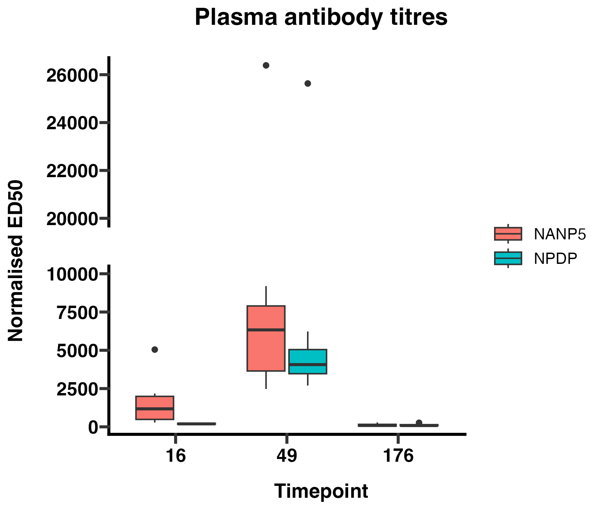

## Day 5: data visualisation
Gigi plot this table!

Pun intended! Today we learned about ggplot. The ggplot2 library is something that many are now already familiar with. I have recently found the tidyplots library [Quarto] (https://tidyplots.org/). It's very nice as it builds on top of ggplot.

One most important thing I have learned today was how to introduce a break into my y-axis. I can do that using the ggbreak library.

```{r}
library(ggbreak)
```

```{r}
#| eval: false
ggplot(merged_filtered %>% filter(Epitope %in% c("NANP5", "NPDP")),
       aes(x = factor(Timepoint), y = normalised, fill = Epitope)) +
  geom_boxplot() +
  labs(
    x = "Timepoint",
    y = "Normalised ED50",
    title = "Plasma antibody titres"
  ) +
  theme_prism() +
  theme(
    plot.title = element_text(hjust = 0.5),
    text = element_text(size = 14)
  ) +
  scale_y_break(breaks = c(10000, 20000), scales = 1, space = 1)

ggsave(
  filename = paste0(figures.dir, "boxplots_axis_break.png"),
  width = 6, height = 5, units = "in", dpi = 300
)
```

